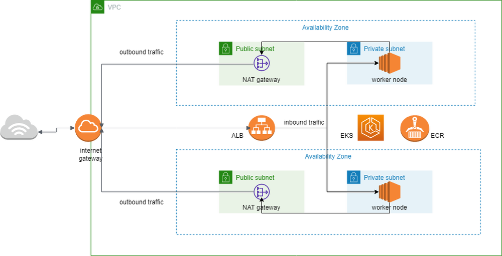

## EKS cluster

This repo is responsible for creating 2 eks clusters, one utility cluster and one app cluster
the utility cluster contains tool use by the CI/CD of the application such as Jenkins and Sonarqube
and the app cluster contains a java 17 application with 2 replicas that recive traffic through a load
balancer created by the aws load balancer controller

## How to use

Since we deploy 2 clusters with this repo that means that we have to use workspaces and we are
saving our state in a remote backend, in my case i choose terraform cloud sinse is very team friendly
here are the commands use to operate the clusters:

To list clusters:

```terraform workspace list```

To deploy utility cluster run:

```terraform workspace select utility-cluster```

```terraform apply```

To deploy app cluster run:

```terraform workspace select app-cluster```

```terraform apply```


## resources use:

- VPC
- Subnets
- Security groups
- Internet Gateway
- NAT gateway
- EKS cluster
- Application Load Balancer
- Autoscaling
- Cloudwatch logs
- RDS
- Helm charts

## controllers use in the kubernetes cluster (EKS):

- external dns for DNS configuration
- load balancer controller to configure the application load balancer
- EFS CSI driver so EFS volumens can be use inside the cluster

## How it works 

This is a multi AZ deployment of a java app, I have use two availability zones to deploy the application, each has one public subnet and one private the private subnet is used to deploy the worker nodes giving us an isolated place to host the app which causes the app to be unable to connect to the internet directly, in order to remedy that i have set up NAT gateways in the public subnet in order to route outbound request from our application to the internet gateway which is what i use to connect the VPC to the internet, I have two NATs gateways in order to keep the infrastructure up even if one of the AZ fails (in reality only one is needed but is best to have two for production environments), additionally i have set up a load balancer with the help of the load balancer controller and my ingress.yml, in order to route traffic to my java service (inbound traffic), as for the worker nodes i have chosen to use manage worker nodes since they require less maintenence on our parts since AWS takes care of updating the guess operating system of the EC2 instances, lastly i want to point out that this infrastructure has been develop having microservices in mind since having our different services decouple makes for a more resilient application that wont fail even if any of its components stops working, this together with the use of IaC makes for an easier experience when dealing with critical errors.

## Diagram

this diagram is a representation of both clusters

